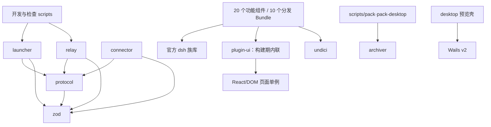

# 代码架构概览

> 由 architecture-map 技能基于源码扫描生成；2026-09-22 已按当前工作树的插件分发改造更新。
> 模块结构变化后更新本文；产品/部署架构仍以 [docs/03-architecture.md](docs/03-architecture.md) 为准。

## 1. 范围与粒度

- pnpm workspace：4 个基础包、1 个纯浏览器构建期 UI 包、20 个功能组件包、4 个纯组合 Bundle 包，以及 1 个壳级 overlay 包（remote-privileged），合计 25 个插件目录；另有独立 Go module `packages/desktop/`（Wails 桌面应用），根目录负责现有开发、检查和交付。
- 扫描 `packages/*/src`、插件入口/README/manifest、`scripts` 和 `packaging`。
- 不将 `node_modules`、`dist`、`release`、`.dev`、锁文件及生成图标当作手写模块。
- 以包/模块组为粒度，不把全部插件、React 组件和工具逐个塞入同一张图。
- 本文区分 **源码 import**、**manifest 分发依赖** 与 **运行期服务/进程协作**。

## 2. 模块一览

| 模块 | 路径与入口 | 职责 | 主要依赖 |
|---|---|---|---|
| 控制面协议 | `packages/protocol/src/index.ts` | 控制帧/schema、编解码、挑战签名消息、membership 与 dsh 重启状态文件契约、版本及超时 | zod；不依赖其他 workspace 包 |
| Connector | `packages/connector/src/cli.ts`、`connector.ts` | Ed25519 身份、membership 监听、控制信道、回拨数据流、退避与致命退出 | protocol、ws、pino、Node net/crypto/fs |
| Relay | `packages/relay/src/cli.ts`、`server.ts` | 浏览器/设备认证、管理页面、机器路由、HTTP/WS 转发、隧道注册表 | protocol、ws、hono、jose、otplib、pino、node:sqlite |
| Launcher | `packages/launcher/src/index.ts` | 配置、profile 初始化、第三方插件首次安装/配套升级、产物定位、trusted host、membership 信任变化时自动重启 dsh、三个子进程的启动与监督 | protocol、commander、zod、官方 plugin-manager；manifest 携带 dsh、relay、connector 与壳级 overlay，不再携带功能插件作为安装锚 |
| 纯浏览器 UI 辅助 | `packages/plugin-ui/src/index.ts` 及职责文件 | dialog 几何/pointer 生命周期、导航图标、Inspector/dock 样式、共享测试纯函数；不注册 dsh service | React 类型/运行时 external；被插件 browser bundle 内联 |
| 设置与模型插件（7） | `packages/plugins/{agents-md,proxy,copilot-auth,models-catalog,model-capabilities,favorite-models,notify}` | 全局提示词、出网代理、模型登录/目录/能力/收藏、桌面通知 | dsh 设置/连接/槽位；代理用 undici，模型目录用 pi-ai |
| 会话插件（3） | `packages/plugins/{turn-retry,chat-scroll,user-message-fork}` | 重试、滚动、用户消息分叉 | dsh 会话/投影/浏览器 UI；仅 turn-retry 有实质宿主业务 |
| 工作区与工具插件（5） | `packages/plugins/{services,terminal,tools-inspector,skills-inspector,files}` | 常驻服务、交互终端、工具/技能历史、右侧 Sidebar 只读文件浏览 | dsh live Agent、工具、PTY、RPC、Sidebar slots；services 自有 Node 进程管理引擎 |
| 环境与预设（6） | `packages/plugins/{remote-settings,remote-privileged,browser-compat,directory-picker-browse,yolo-mode,concise-mode}` | 远程设置（ownsHost、顶部 Open In… Explorer 立即返回与置前增强）、旧 WebKit API 垫片与临时浏览器诊断、网页目录选择、固定 YOLO、精简预设；remote-privileged 携带壳级 connection 注入和模型 HMR 启动屏障 | 功能组件进入第三方分发 Bundle；remote-privileged 由壳常驻加载 |
| 开发与验证脚本 | `scripts/dev-stack.mjs`、`dev-runtime.mjs`、`plugin-distributions.mjs`、`prepare-desktop.mjs`、`local-config.mjs`、`*-check.mjs` | 本地全链路、隔离 dsh 运行时、开发插件介质、插件契约冒烟与依赖检查 | launcher/relay 源码模块、Node；脚本各自声明环境前提 |
| 发行打包 | `scripts/release.mjs`（统一入口）、`scripts/pack.mjs`（服务版 zip，仅 linux-x64）、`scripts/pack-desktop.mjs`（桌面 setup/portable）、`packaging/`、`.github/workflows/` | 四个发布端介质（D22：win/mac/linux 桌面版 + Linux 服务版，各 lite/full；桌面再分 setup/portable）、构建一次串行打包、产物检查、启动脚本、图标、CI | archiver、pnpm、Go 工具链；服务版不带 Node 二进制 |
| Windows 托盘（已退役） | `packaging/win-launcher/*.go` | 菜单、单实例、自启动、日志轮转、Node launcher 生命周期；win 服务版退役（D22）后不再随介质构建，syso 资源仍供桌面壳，去留见路线图 | Go 标准库、Win32 API；同一 `package main`，无第三方 Go 包 |
| 桌面应用 | `packages/desktop/{main,config,bootstrap,statuspage,backend,discover,notifypipe}.go`、`tray_windows.go` | Wails v2 单窗口：独立模式托管自有 launcher 后台（`--desktop` 状态行契约 + 实例锁 + 随包/系统 Node 发现），attach 模式附着开发栈；AssetServer 持有 webview 初始导航直到后台就绪再 302 进真实 origin；Win32 托盘含后台启停与自重启恢复；通知管道带共享令牌 | 独立 Go module `github.com/wailsapp/wails/v2@v2.16.0`；原生网络/权限隔离（S1.3）仍未实现，mac/Linux 托盘与实机验收待 S10 |

20 个功能组件按 `plugin-catalog.json` 分发为 4 个组合包与 6 个独立第三方 Bundle；首次默认安装，仍安装项随 dsh-station 配套升级，卸载后不自动补回。唯一随 `--patch` 传入的是 remote-privileged 的壳级 overlay，包含 connection 注入和模型 HMR 启动屏障，不属于第三方插件生命周期。`@dsh-station/plugin-ui` 是构建期辅助，也不进入分发清单。
具体功能及使用限制见 [插件索引](docs/plugins.md) 和各包 README。

## 3. 源码依赖关系图

箭头指向被 import 的模块；插件集合包含宿主/浏览器两个构建目标，**不是一个共享运行时包**。
图省略包内依赖和多数第三方库；不把 spawn、配置字符串、manifest 依赖画成 import 边。

### 边的源码证据

| 边 | 可核查的 import 位置 |
|---|---|
| scripts → launcher | `scripts/dev-stack.mjs:17`、`scripts/concise-mode-check.mjs:18`：profile 模块 |
| scripts → relay | `scripts/dev-stack.mjs:18`：store 入口 |
| launcher → protocol | `packages/launcher/src/config.ts:6`、`membership.ts:4`、`dsh-restart.ts:11`、`relay.ts:4` |
| relay → protocol | `packages/relay/src/server.ts:6–9`、`http/security.ts:3`、`auth/device.ts:5` |
| connector → protocol | `packages/connector/src/backoff.ts:1`、`config.ts:3`、`control.ts:5–19` |
| plugins → dsh 族库 | `services/src/index.ts` 的 defineTool；`model-capabilities/src/index.ts:3` 的 schemastery；浏览器入口导入官方 UI/slots |
| plugins → plugin-ui | services/turn-retry 的 dialog adapter、agents-md/proxy/notify/browser-compat 的 nav-glyph、skills/tools inspector 的 View、services/terminal 的 dock styles 均 import `@dsh-station/plugin-ui` |
| plugin-ui → React | `packages/plugin-ui/src/dialog-pointer.tsx`、`navigation-glyph.ts`、`inspector.tsx`、`dock-styles.ts` |
| plugins → undici | `packages/plugins/proxy/src/dispatcher.ts:22` |
| launcher/relay/connector/protocol → zod | 各包的 `src/config.ts`（protocol 为 `src/frames.ts`） |
| pack → archiver | `scripts/pack.mjs:42`（经 `pack/archive.mjs`）、`scripts/pack-desktop.mjs:34` |
| desktop → Wails | `packages/desktop/main.go`：Wails app、托盘回调与模式选择；`bootstrap.go`（attach 引导 302）/`statuspage.go`（独立模式持有初始导航）；`backend.go` 托管 launcher 子进程并解析 `@@DSH_STATION` 状态行 |

这些核心包级生产 import 边未形成环；未发现插件相互 import/re-export。
补充 TypeScript AST 扫描覆盖 377 个 TS/TSX/MJS 文件，可解析的本地相对路径值导入图也未发现环。
此结论不覆盖 Cordis 注入图、未解析的包 exports 条件或第三方依赖树。
`tools-inspector` **不 import services**：它从同一 dsh 工具注册表读取可见工具并回放日志。

## 4. 关键内部边界

### Relay

- `server.ts` 是装配与分派入口：主端口/成员端口、首次设置、公开资源、认证、HTTP 与 upgrade。
- `admin/` 是 Hono 管理页面与操作；`auth/` 是密码、TOTP、会话、cookie、限流和设备签名。
- `http/security.ts` 校验原始请求；`proxy.ts` 与 `upgrade.ts` 分别传送 HTTP 和 WS。
- `tunnel/server.ts` 处理控制/数据连接；`registry.ts` 管理在线机器、pending stream 与一次性 token。
- `store/` 持有 SQLite 和迁移；`audit/` 写数据库及 pino；`membership/` 管理本机远程入口文件。
- 请求顺序必须保留：浏览器认证 → 原始 Host/Origin/sec-fetch-site → 隧道；upgrade 单独处理。
- 公开固定资源、主题切换、设置/认证入口有各自显式分支，不能用统一中间件随意重排。

### Connector 与 Launcher

- connector 的 `connector.ts` 管重连/membership 状态；`control.ts` 管单次认证/心跳；`stream.ts` 管字节搬运。
- launcher 的 `profile.ts` 初始化基础 profile，`plugin-catalog.ts` / `plugin-lifecycle.ts` 管第三方插件分发，`dsh-plugins.ts` 只管壳级 overlay；`dsh.ts`/`relay.ts`/`connector.ts` 生成各自启动参数。
- `supervisor.ts` 管子进程、输出及停止；`jwt-secret.ts` 和 `membership.ts` 只处理对应本地配置。
- launcher 不实现账号管理页面；`relay-admin.ts` 只读数据库判断是否已有管理员。
- dsh、relay、connector 是 launcher **spawn 的独立进程**，不是 launcher import 后在进程内运行。
- 标准 `DSH_HOME` 保存 dsh 设置/会话；dsh-station home 保存设备身份、membership、relay 数据，二者独立。

### 桌面预览与后台所有权

- `packages/desktop/` 有两种模式：默认独立模式托管自有后台（发现随包载荷与 Node、`--desktop` 拉起 launcher、实例锁防双开、Job Object 崩溃回收），`--attach` 开发模式附着已运行栈。托盘「启动/重启后台」通过壳自重启恢复（webview 初始导航一生一次，页面发起的跳转进不了 relay——见 statuspage.go 注释）。
- Wails AssetServer 在 attach 模式对 `/` 发一次 302；独立模式持有初始导航直到 relay 端口监听再 302（launcher 先起 relay，插件同步与 dsh 就绪前的等待由 relay 自己的重试页承担；Wails v2 首次导航完成前不显示窗口，窗口出现时刻≈relay 监听时刻）。HTTP/WS、认证和插件资源均从真实 relay origin 加载，不对业务页提供除窗口控制外的 Go Bindings。桌面介质由 `scripts/pack-desktop.mjs` 在对应平台产出（win NSIS setup + 便携 zip、mac DMG + .app 便携 zip、linux deb + 便携 zip，统一入口 `scripts/release.mjs`），随包 Node 清单在 `packaging/desktop-node.json`。**没有原生网络/系统权限隔离（S1.3）**；参数校验只限定初始地址，风险及构建方式见 `packages/desktop/README.md`。

### 插件双端与运行期协作

- 通常按 `src/index.ts`（宿主）、`src/client/index.tsx`（浏览器）、`shared.ts`（纯契约）分层。
- `browser-compat` 的 Host head 注入脚本先安装旧 Web API 垫片并创建有界内存诊断桥；client 半只通过该桥注册设置页和补充 `slots.onEntryError`，不使用 RPC、settings 或持久化。
- `services` 的 `core.ts`/`manager.ts` 不依赖 dsh；入口负责工具、RPC 及沙箱外 spawn 的批准门。core 已拆为 registry、logs、process-identity、process-lifecycle、readiness，入口通过显式 re-export 保持旧导出。
- `files` 只以 `session.header.cwd` 为 Git 投影根；原生 `ui-sidebar-files`/`ui-sidebar-documentpreview` 负责文件读写视图，插件浏览器半以 slot shadow 增强原生树、双 pane 导航、Git 状态、临时预览/图片缩放、Space + 鼠标左键拖动平移和右键菜单；首次 guide 入口用非用户可见 sentinel 保持可达，不注册文件写入接口。
- `tools-inspector`/`skills-inspector` 回放既有持久化事件；不 append 自定义 Session 事件。
- `copilot-auth` 组合模型 provider-card；`model-capabilities` 通过子槽挂 UI，通过 Cordis 获取 models-catalog 服务。
- `models-catalog` 与能力插件用启动屏障保证同一 pi-ai map 先恢复再加载模型；这些是**服务依赖，不是 import**。
- `proxy` 沿用 dsh 原生代理策略的同一实例，为原生 fetch 与官方网页抓取提供跟随环境（默认）、使用插件代理地址、强制直连三态；不承诺接管子进程、独立 WebSocket 或独立网络库，不能为每个模型插件增加另一份代理配置。
- `plugin-ui` 只由浏览器侧消费，client tsdown 配置把它内联；React、Cordis、store、slots、ui-primitives 仍 external，避免页面出现第二个单例。
- 浏览器 React/Cordis/store/slots/ui-primitives external；不能通过“共享工具包”重复打包这些单例。
- SettingsScope.mutate 可能拒绝写入却正常 resolve；必须共享校验、保存回读、失败保留草稿。

## 5. 装载、交付与验证

- profile 基础顺序是 `dsh-base → dsh-web-app`；随后由
  `packages/launcher/src/plugin-lifecycle.ts` 通过官方 plugin-manager 安装并选择第三方分发 Bundle。
  Bundle 层之后仍依次应用 profile patch、home patch 和 CLI overlay。
- `plugin-catalog.json` 是壳级 overlay、4 个组合包、6 个独立包、20 个组件及稳定行 ID 的唯一
  权威清单。组合包保留组件行开关；model-enhancements 的 models-catalog 与
  model-capabilities 共同参与 `llm-pi-ai` 启动屏障，不可单独停用。directory-picker-browse
  需要静态覆盖原生服务，故独立分发。
- 新 profile 首次默认安装全部 10 个分发包；后续升级所有仍安装项并保持 Bundle/组件停用。
  已卸载包不补回，需要由用户从发行版 `plugins/<目录>` 或开发 `.dev/plugins/<目录>` 经官方
  「添加插件」重装。
- launcher 在安装前把介质和其运行时依赖复制到 profile 内 `.dsh-station-plugin-media/`，避免 Windows
  跨盘 `link:` 不生成目录链接；检测到旧 profile 由其他 pnpm 主版本创建时，会暂存并重建
  `node_modules`，失败则恢复原目录和 manifest/lockfile。
- `scripts/plugin-distributions.mjs` 从源码包生成可搬移介质：组合包的固定版本组件闭包位于其
  `node_modules/@dsh-station/`，独立包携带自身 patch、宿主与浏览器产物，`catalog.json` 描述安装项。
- `pnpm run dev` 依次构建功能插件、生成 `.dev/plugins/`、由 `scripts/dev-runtime.mjs` 在仓库
  同级准备无工作区同名安装锚的隔离 dsh 运行时，再启动 `dev-stack.mjs`。开发栈使用独立 home
  （`~/.dsh-station-dev` + `~/.dsh-dev`）与错开的端口（relay 31809 / dsh 3180），可与已安装
  发行版实例同时运行；profile 名仍为 `dsh-station-web`，生命周期与发行版共用。
  `pnpm relay:init/passwd/totp-reset` 因此作用于开发 home。
- 服务版打包通过 `scripts/pack.mjs`（仅 linux-x64，D22）在包根生成 `plugins/` 并归档；launcher production
  dependencies 只保留运行时和壳级 overlay，不再承担功能插件安装锚。打包检查覆盖介质目录、
  依赖闭包、宿主/浏览器产物、离线内容和可搬移路径。
- 唯一 CLI overlay 是 remote-privileged；它由 launcher 强制解析并传给 dsh，不可停用或卸载。
  除 connection 注入外，它固定 `llm-pi-ai` 的两个模型启动依赖，并在模型增强未随进程启动时提供
  root-fiber 占位屏障，避免 Bundle 在线启停触发上游模型适配器热重启。
- 简洁模式的两个预设在 Bundle patch 中内联声明 `@deepseek-ai/dsh-agent-preset` 行，不加载 preset root 或 locator entry；子代理深度由 dsh 原生界面配置，默认 1。
- `pnpm check:dependencies`、`pnpm lint`、`pnpm typecheck`、`pnpm build`、`pnpm test` 是仓库级基础检查。
- 插件冒烟入口统一见 [docs/02-dsh-facts.md](docs/02-dsh-facts.md)；运行前阅读脚本环境与产物要求。
- 改插件必须构建并重启 dsh；无 HMR。实机、深浅主题、移动端与公网链路验收不能用单元测试代替。

## 6. 维护原则

协议包不容纳 dsh 业务、文件 IO 或 UI；relay 不解析 dsh 业务协议（首页 401 token 跳转除外）。
不修改/fork 官方 dsh，不新增插件管理器，不把独立插件互相 import 作为默认复用方式。
模块职责或装载方式调整时，同步更新本文、相关包 README 和对应 `docs/dsh/` 契约。
