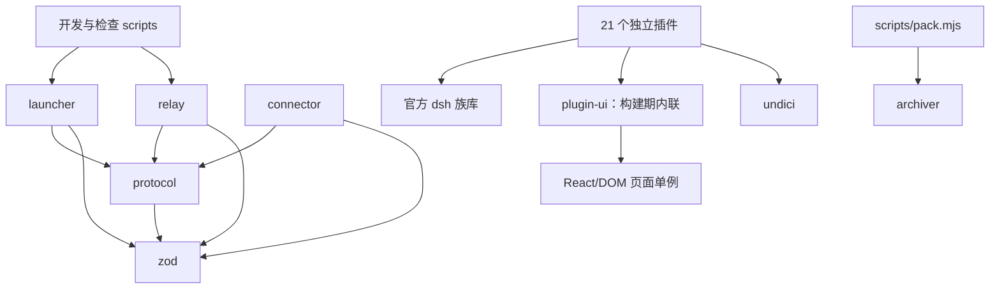

# 代码架构概览

> 由 architecture-map 技能于 2026-09-11 基于源码扫描生成；基线提交 `67de12e`。
> 模块结构变化后更新本文；产品/部署架构仍以 [docs/03-architecture.md](docs/03-architecture.md) 为准。

## 1. 范围与粒度

- pnpm workspace：4 个基础包、1 个纯浏览器构建期 UI 包、21 个插件包；根目录负责开发、检查和交付。
- 扫描 `packages/*/src`、插件入口/README/manifest、`scripts` 和 `packaging`。
- 不将 `node_modules`、`dist`、`release`、`.dev`、锁文件及生成图标当作手写模块。
- 以包/模块组为粒度，不把全部插件、React 组件和工具逐个塞入同一张图。
- 本文区分 **源码 import**、**manifest 分发依赖** 与 **运行期服务/进程协作**。

## 2. 模块一览

| 模块 | 路径与入口 | 职责 | 主要依赖 |
|---|---|---|---|
| 控制面协议 | `packages/protocol/src/index.ts` | 控制帧/schema、编解码、挑战签名消息、membership 文件契约、版本及超时 | zod；不依赖其他 workspace 包 |
| Connector | `packages/connector/src/cli.ts`、`connector.ts` | Ed25519 身份、membership 监听、控制信道、回拨数据流、退避与致命退出 | protocol、ws、pino、Node net/crypto/fs |
| Relay | `packages/relay/src/cli.ts`、`server.ts` | 浏览器/设备认证、管理页面、机器路由、HTTP/WS 转发、隧道注册表 | protocol、ws、hono、jose、otplib、pino、node:sqlite |
| Launcher | `packages/launcher/src/index.ts` | 配置、profile 补齐、产物定位、trusted host、三个子进程的启动与监督 | protocol、commander、zod；manifest 携带 dsh、relay、connector 和全部插件 |
| 纯浏览器 UI 辅助 | `packages/plugin-ui/src/index.ts` 及职责文件 | dialog 几何/pointer 生命周期、导航图标、Inspector/dock 样式、共享测试纯函数；不注册 dsh service | React 类型/运行时 external；被插件 browser bundle 内联 |
| 设置与模型插件（8） | `packages/plugins/{agents-md,proxy,copilot-auth,models-catalog,model-capabilities,favorite-models,subagent-depth,notify}` | 全局提示词、出网代理、模型登录/目录/能力/收藏、深度设置、桌面通知 | dsh 设置/连接/槽位；代理用 undici，模型目录用 pi-ai |
| 会话插件（4） | `packages/plugins/{exec-process,turn-retry,chat-scroll,user-message-fork}` | 执行过程折叠、重试、滚动、用户消息分叉 | dsh 会话/投影/浏览器 UI；仅 turn-retry 有实质宿主业务 |
| 工作区与工具插件（5） | `packages/plugins/{services,terminal,tools-inspector,skills-inspector,files}` | 常驻服务、交互终端、工具/技能历史、右侧 Sidebar 只读文件浏览 | dsh live Agent、工具、PTY、RPC、Sidebar slots；services 自有 Node 进程管理引擎 |
| 环境与预设插件（5） | `packages/plugins/{remote-privileged,browser-compat,directory-picker-browse,yolo-mode,concise-mode}` | 远程设置、旧 WebKit API 垫片与临时浏览器诊断、网页目录选择、固定 YOLO、精简预设 | dsh 插件组合；concise-mode 是 Bundle，其余是 overlay |
| 开发与验证脚本 | `scripts/dev-stack.mjs`、`local-config.mjs`、`*-check.mjs` | 本地全链路、独立凭据目录、插件契约冒烟、依赖检查 | launcher/relay 源码模块、Node；脚本各自声明环境前提 |
| 发行打包 | `scripts/pack.mjs`、`packaging/`、`.github/workflows/` | 分平台 deploy/归档、产物检查、启动脚本、图标、CI | archiver、pnpm、Go 工具链；不带 Node 二进制 |
| Windows 托盘 | `packaging/win-launcher/*.go` | 菜单、单实例、自启动、日志轮转、Node launcher 生命周期 | Go 标准库、Win32 API；同一 `package main`，无第三方 Go 包 |

22 个插件中 21 个普通 overlay，1 个 Profile Bundle；18 个有浏览器入口。`@dsh-remote/plugin-ui` 不是插件，不进入 overlay 清单或 launcher 插件顺序。
具体功能及使用限制见 [插件索引](docs/plugins.md) 和各包 README。

## 3. 源码依赖关系图

箭头指向被 import 的模块；插件集合包含宿主/浏览器两个构建目标，**不是一个共享运行时包**。
图省略包内依赖和多数第三方库；不把 spawn、配置字符串、manifest 依赖画成 import 边。

### 边的源码证据

| 边 | 可核查的 import 位置 |
|---|---|
| scripts → launcher | `scripts/dev-stack.mjs:17`、`scripts/concise-mode-check.mjs:18`：profile 模块 |
| scripts → relay | `scripts/dev-stack.mjs:18`：store 入口 |
| launcher → protocol | `packages/launcher/src/config.ts:6`、`membership.ts:4`、`relay.ts:4` |
| relay → protocol | `packages/relay/src/server.ts:6–9`、`http/security.ts:3`、`auth/device.ts:5` |
| connector → protocol | `packages/connector/src/backoff.ts:1`、`config.ts:3`、`control.ts:5–19` |
| plugins → dsh 族库 | `services/src/index.ts` 的 defineTool；`model-capabilities/src/index.ts:3` 的 schemastery；浏览器入口导入官方 UI/slots |
| plugins → plugin-ui | services/turn-retry 的 dialog adapter、agents-md/proxy/notify/browser-compat 的 nav-glyph、skills/tools inspector 的 View、services/terminal 的 dock styles 均 import `@dsh-remote/plugin-ui` |
| plugin-ui → React | `packages/plugin-ui/src/dialog-pointer.tsx`、`navigation-glyph.ts`、`inspector.tsx`、`dock-styles.ts` |
| plugins → undici | `packages/plugins/proxy/src/dispatcher.ts:22` |
| launcher/relay/connector/protocol → zod | 各包的 `src/config.ts`（protocol 为 `src/frames.ts`） |
| pack → archiver | `scripts/pack.mjs:76` |

这些核心包级生产 import 边未形成环；未发现插件相互 import/re-export。
补充 TypeScript AST 扫描覆盖 377 个 TS/TSX/MJS 文件，可解析的本地相对路径值导入图也未发现环。
此结论不覆盖 Cordis 注入图、未解析的包 exports 条件或第三方依赖树。
`tools-inspector` **不 import services**：它从同一 dsh 工具注册表读取可见工具并回放日志。

## 4. 关键内部边界

### Relay

- `server.ts` 是装配与分派入口：主端口/成员端口、首次设置、公开资源、认证、HTTP 与 upgrade。
- `admin/` 是 Hono 管理页面与操作；`auth/` 是密码、TOTP、会话、cookie、限流和设备签名。
- `http/security.ts` 校验原始请求；`proxy.ts` 与 `upgrade.ts` 分别传送 HTTP 和 WS。
- `tunnel/server.ts` 处理控制/数据连接；`registry.ts` 管理在线机器、pending stream 与一次性 token。
- `store/` 持有 SQLite 和迁移；`audit/` 写数据库及 pino；`membership/` 管理本机远程入口文件。
- 请求顺序必须保留：浏览器认证 → 原始 Host/Origin/sec-fetch-site → 隧道；upgrade 单独处理。
- 公开固定资源、主题切换、设置/认证入口有各自显式分支，不能用统一中间件随意重排。

### Connector 与 Launcher

- connector 的 `connector.ts` 管重连/membership 状态；`control.ts` 管单次认证/心跳；`stream.ts` 管字节搬运。
- launcher 的 `profile.ts`、`dsh-plugins.ts` 管装载；`dsh.ts`/`relay.ts`/`connector.ts` 生成各自启动参数。
- `supervisor.ts` 管子进程、输出及停止；`jwt-secret.ts` 和 `membership.ts` 只处理对应本地配置。
- launcher 不实现账号管理页面；`relay-admin.ts` 只读数据库判断是否已有管理员。
- dsh、relay、connector 是 launcher **spawn 的独立进程**，不是 launcher import 后在进程内运行。
- 标准 `DSH_HOME` 保存 dsh 设置/会话；dsh-remote home 保存设备身份、membership、relay 数据，二者独立。

### 插件双端与运行期协作

- 通常按 `src/index.ts`（宿主）、`src/client/index.tsx`（浏览器）、`shared.ts`（纯契约）分层。
- `browser-compat` 的 Host head 注入脚本先安装旧 Web API 垫片并创建有界内存诊断桥；client 半只通过该桥注册设置页和补充 `slots.onEntryError`，不使用 RPC、settings 或持久化。
- `services` 的 `core.ts`/`manager.ts` 不依赖 dsh；入口负责工具、RPC 及沙箱外 spawn 的批准门。core 已拆为 registry、logs、process-identity、process-lifecycle、readiness，入口通过显式 re-export 保持旧导出。
- `files` 只以 `session.header.cwd` 为 Git 投影根；原生 `ui-sidebar-files`/`ui-sidebar-documentpreview` 负责文件读写视图，插件浏览器半以 slot shadow 增强原生树、双 pane 导航、Git 状态、临时预览/图片缩放和右键菜单；首次 guide 入口用非用户可见 sentinel 保持可达，不注册文件写入接口。
- `tools-inspector`/`skills-inspector` 回放既有持久化事件；不 append 自定义 Session 事件。
- `copilot-auth` 组合模型 provider-card；`model-capabilities` 通过子槽挂 UI，通过 Cordis 获取 models-catalog 服务。
- `models-catalog` 与能力插件用启动屏障保证同一 pi-ai map 先恢复再加载模型；这些是**服务依赖，不是 import**。
- `proxy` 提供进程唯一 Undici dispatcher；不能为每个模型插件增加另一份代理配置或客户端运行时。
- `plugin-ui` 只由浏览器侧消费，client tsdown 配置把它内联；React、Cordis、store、slots、ui-primitives 仍 external，避免页面出现第二个单例。
- 浏览器 React/Cordis/store/slots/ui-primitives external；不能通过“共享工具包”重复打包这些单例。
- SettingsScope.mutate 可能拒绝写入却正常 resolve；必须共享校验、保存回读、失败保留草稿。

## 5. 装载、交付与验证

- profile 顺序：`dsh-base → dsh-web-app → dsh-plugin-concise-mode`，再叠加 profile/home patch 与 CLI overlays。
- 普通插件清单在 `packages/launcher/src/dsh-plugins.ts`；代理位于出网插件前，YOLO 为最后一个普通 overlay。
- `scripts/local-config.mjs` 扫目录读取 manifest/产物，`dev-stack.mjs` 编排开发装载；不能仅凭目录顺序推断生产顺序。冒烟脚本的 home、dsh 生命周期、RPC、bundle loader 和 VM shim 位于 `scripts/lib/`，各检查只保留独特契约断言。
- `scripts/pack.mjs` 只负责参数/前置检查/目标调度；`scripts/pack/{manifest,deploy,platform,verify,archive}.mjs` 分担清单、deploy、裁剪、验证与归档。launcher manifest 的 workspace dependencies 确保绿色包携带插件。
- 托盘通过 `packaging/win-launcher/stack.go` 启动 Node launcher；Go 文件内部调用不是独立模块 import 边。
- `pnpm check:dependencies`、`pnpm lint`、`pnpm typecheck`、`pnpm build`、`pnpm test` 是仓库级基础检查。
- 插件冒烟入口统一见 [docs/02-dsh-facts.md](docs/02-dsh-facts.md)；运行前阅读脚本环境与产物要求。
- 改插件必须构建并重启 dsh；无 HMR。实机、深浅主题、移动端与公网链路验收不能用单元测试代替。

## 6. 维护原则

协议包不容纳 dsh 业务、文件 IO 或 UI；relay 不解析 dsh 业务协议（首页 401 token 跳转除外）。
不修改/fork 官方 dsh，不新增插件管理器，不把独立插件互相 import 作为默认复用方式。
模块职责或装载方式调整时，同步更新本文、相关包 README 和对应 `docs/dsh/` 契约。
