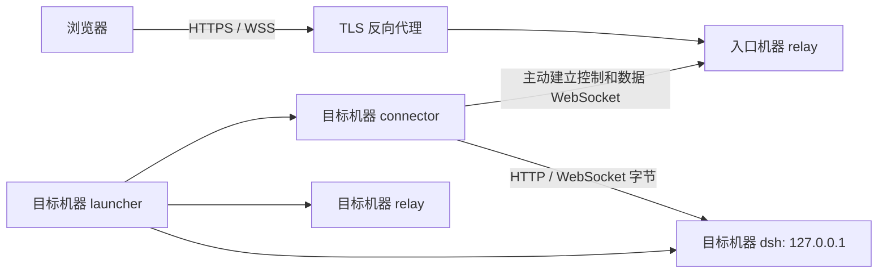

# 03 · 架构

## 1. 全景

每台机器运行自己的 dsh、relay 和 connector。任意机器都可以提供远程入口；
一台机器最多配置一个远程入口，开放关系是单向的。



打开 pc2 的页面就是操作 pc2 的文件与进程，入口机器 pc1 只转发请求。

## 2. 组件与插件

| 包 | 职责 |
|---|---|
| `packages/protocol` | 控制帧、schema、协议版本、超时与错误码 |
| `packages/connector` | 拨出隧道、设备签名认证、回拨数据流、重连 |
| `packages/relay` | 浏览器认证、设备认证、管理页、机器路由与字节转发 |
| `packages/launcher` | 配置、profile、产物检查、启动和监督三个子进程 |
| `packages/plugins` | 通过 dsh 插件扩展功能；见 [插件索引](plugins.md) |
| `packages/plugins`（规划） | 全部插件转为可停用的默认受管 Bundle（简洁模式已完成）；connection 注入地基拆归壳级常驻；独立发布暂缓，见 [计划](plugin-optional-plan.md)（D20） |

dsh 是官方 npm 依赖，不 fork、不改源码。浏览器使用 dsh 自带 UI，relay 提供自己的登录和管理页。

### Home 与 Profile

沿用标准 `$DSH_HOME`（默认 `~/.dsh`），共享设置、凭据、会话和用户全局 patch。
内置扩展只加载到 `dsh-remote-web`：

```text
dsh-base → dsh-web-app → dsh-plugin-concise-mode
  → profile patch → home patch → --patch overlays
```

launcher 对已有 profile 只补入缺失的 concise Bundle，保留其他配置。
预设能力见 [简洁模式](../packages/plugins/concise-mode/README.md)。

### 普通插件装载

每个普通插件带 `dsh-overlay.yml`，入口写相对路径 `./dist/index.js`。
dsh 将它锚定到 overlay 所在目录，发行包移动后仍可解析。
launcher 和开发栈都以 `--patch` 加载，并检查宿主与浏览器产物，缺失即拒绝启动。

装载清单以 [dsh-plugins.ts](../packages/launcher/src/dsh-plugins.ts) 为准：
代理在其他出网插件之前生效，固定 YOLO 是最后一个普通 overlay。
开发入口为 [dev-stack.mjs](../scripts/dev-stack.mjs)，由 [local-config.mjs](../scripts/local-config.mjs) 提供 overlay 路径。

第三方 Bundle 使用官方命令：

```powershell
dsh plugin --profile dsh-remote-web add <bundle-package>
```

此 profile 没有 HMR；改动插件后必须构建并重启 dsh。

## 3. 机器路由

| 顺序 | 路由键 | 示例 |
|---|---|---|
| 0 | publicDomain 裸域名（仅管理入口） | `dsh.example.com` → `/_admin` |
| 1 | publicDomain 下的子域名 | `pc2.dsh.example.com` |
| 2 | 持久化的每机器端口 | `10.1.2.87:30810` |
| 3 | directSlug | 入口机器自己的 `10.1.2.87:30809` 或本机 `127.0.0.1:30809` |

dsh 使用绝对 `/api` 路径，所以每台机器必须有独立 origin，不能放在子路径下。
域名模式默认不打开成员端口，新增机器只需注册设备；同一台机器的本机 loopback 入口仍保留。
端口模式不需要域名；同主机不同端口共享 cookie，边界见 [安全](04-security.md)。

## 4. 隧道协议

### 4.1 每条流独立

采用 work connection 模型：一条控制 WebSocket 管理设备，每条数据流使用独立 WebSocket。
一条流失败不影响其他流；新数据流需要额外一次回拨。

### 4.2 控制信道

路径 `/_tunnel/control`，当前协议版本为 3。

1. connector 发送 hello，relay 下发随机挑战。
2. connector 用 Ed25519 私钥签名；首次注册携带一次性注册令牌。
3. relay 验证签名和设备状态，完成认证后标记在线。
4. 控制帧承载 open-stream、心跳、dsh token 和状态上报。

心跳每 30 秒一次，90 秒无响应判离线。重连按 1 至 30 秒指数退避并加抖动。
设备被停止并移除等致命错误使 connector 退出，launcher 随之关闭整套进程。

### 4.3 数据信道

1. relay 生成 stream id 和 60 秒有效的一次性 stream token。
2. 经控制信道通知 connector 回拨 `/_tunnel/stream`。
3. relay 验证 token 并配对；connector 连接 `127.0.0.1:<dsh.port>`。
4. connector 双向搬运字节，不解析 HTTP 或 dsh 业务数据。

HTTP 转发使用 `node:http`，通过 `createConnection` 注入隧道 Duplex。
WebSocket 走独立 upgrade 路径，不能交给普通 HTTP 路由处理。

### 4.4 dsh 信任与浏览器认证

relay 原样转发 Host/Origin；launcher 为 dsh 声明浏览器使用的 trusted host。
条目必须是裸 host 或 host:port，错误格式会导致 dsh 启动失败。
远程设置能力由 [remote-privileged](../packages/plugins/remote-privileged/README.md) 提供。

launcher 从 dsh 输出截获启动 token，经 connector 的 dsh-auth 帧上报 relay。
仅当 dsh 对首页返回 401，relay 才返回一次 `?token=` 重定向，让 dsh 自己交换 cookie。
已带 token 的请求不重定向，API 的 401 原样透传；relay 登录始终在此前完成。

必须原样转发 `/plugins/??…` combo 路由的 raw URI。
`/api/remote.mux` 是唯一的 dsh 下行多路复用 WebSocket。
源码依据见 [传输与浏览器认证](dsh/transport.md)。

## 5. 技术选型

| 用途 | 实现 |
|---|---|
| 语言、工作区 | TypeScript、ESM、pnpm workspace |
| 构建、开发、测试 | tsdown、tsx、Vitest |
| WebSocket、管理页 | ws；hono 只用于管理页 |
| 校验、持久化 | zod；Node 内置 node:sqlite |
| 密码、设备签名 | Node 内置 scrypt、Ed25519 |
| JWT、TOTP、限流 | jose、otplib、rate-limiter-flexible |
| 日志 | pino |
| Windows 托盘 | Go 标准库与 Win32 API |

直接依赖固定版本，版本以 manifest 为准，`pnpm check:dependencies` 检查。
launcher、relay、connector 不引入原生模块；dsh 的平台依赖决定发行包按平台分发。

## 6. 请求顺序

1. 公网 HTTPS 由反向代理终结，原始 Host 保留；本机 loopback HTTP 直接连接 relay，不经过公网反代。
2. relay 验证浏览器会话；仅 loopback socket 与 loopback Host 同时成立才免登录。
3. 校验原始 Host/Origin、sec-fetch-site，域名公网请求要求 HTTPS Origin，loopback 请求允许 HTTP Origin；解析目标机器并检查访问权限及在线状态。
4. 创建隧道数据流，原样转发请求头、URL、body。
5. dsh 验证信任规则及自己的 cookie，响应经原路返回。

relay 不解析、缓存或重建 dsh 业务协议；首页 token 重定向是唯一业务相关例外。